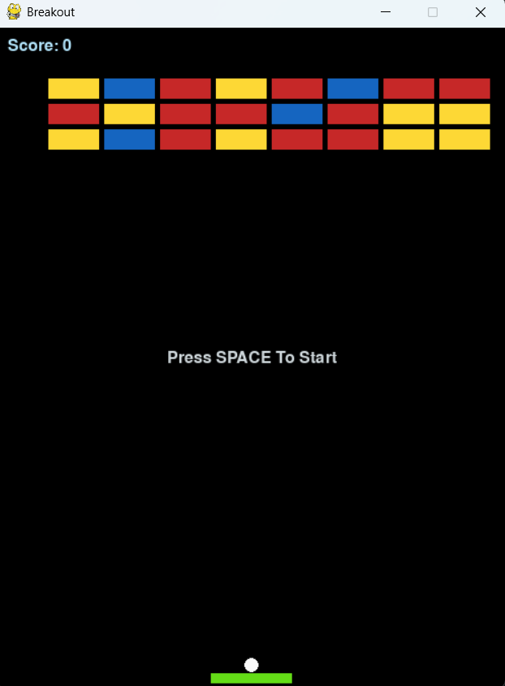
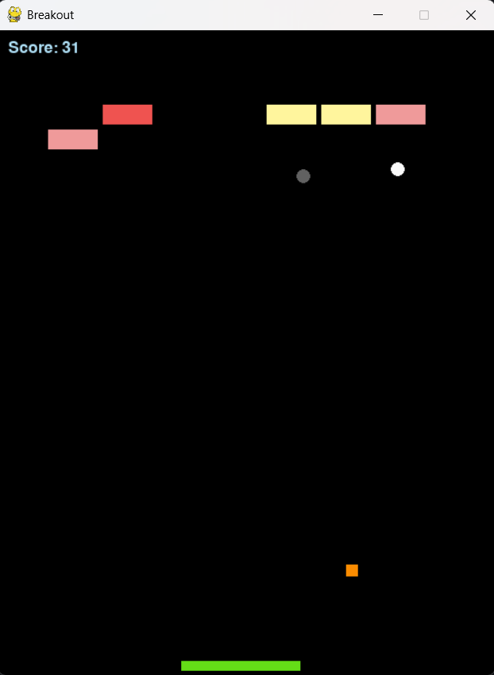

# Breakout Game
A modern, modular, and power‑up enhanced version of the classic Breakout game built with Python and Pygame.
This project was built as a learning-focused game development exercise with the goal of writing clean,
extendable, and well-structured code while going beyond a simple Breakout clone.

---

## Screenshots
### Gameplay


### Power-Ups


---

## Features
- Modular architecture (Ball, Paddle, Brick, PowerUp, Game Controller)
- Extensible structure
- Multiple power-ups (Double, Triple, Big Paddle)
- Extra ball mechanics
- Brick durability system
- Sound effects
- Restart system (R to restart, Q to quit)
- Clean and readable codebase
- Centralized settings for easy tuning of game data and objects

---

## Installation

### 1. Clone the repository
```bash
    git clone https://github.com/Younes-0l/breakout-game.git
    cd breakout-game
```

### 2. Install package dependencies
```bash
    pip install pygame
```

### 3. Run the game
```bash
    python main.py
```

---

## Project Structure
```
    assets/
    │── sounds/
    |── screenshots/
    game/
    │── ball.py
    │── brick.py
    │── game.py
    │── paddle.py
    │── powerup.py
    |── settings.py
    main.py
    README.md
```

---

## How it works

### Ball
- Handles movement, wall collisions, paddle and brick interactions.

### Paddle
- Player-controlled horizontal movement.
- Can grow temporarily with power-ups.

### Bricks
- Different durability levels.
- Can drop power-ups when destroyed.

### Power-Ups
- **Double** → spawns 2 balls  
- **Triple** → spawns 3 balls  
- **Big Paddle** → increases paddle size for 12 seconds  

### Game Control
- Manages game loop, rendering, scoring, win/lose states.

---

## Future Improvements

- Multiple levels
- Animations
- Pause menu
- Leaderboard
- More power-ups
- Background music

---

## Author
Developed by Younes as a personal learning project.